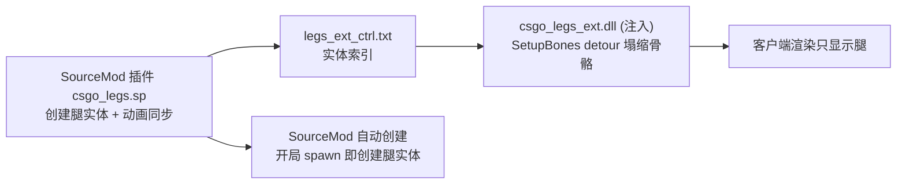

# CS:GO Legacy 看腿（第一人称看自己的腿）— 半成品归档

> **状态：半成品，留给后人。** 项目能跑（能看到腿实体 + 动画同步 + 上半身骨骼隐藏尝试），
> 但存在已知问题（见下）。本文记录了所有踩过的坑和已验证的结论，后人可直接续作。

## 目标

在 CS:GO Legacy（MIGI 单机精简版，`D:\SteamLibrary\steamapps\common\csgo legacy\`）里
实现**第一人称低头看到自己的腿**：
- SourceMod 插件创建 `monster_generic` 腿实体（自动跟随玩家、同步动画）
- **注入 DLL** hook `client.dll` 的 `SetupBones`，把腿实体 hand/arm/head 骨骼矩阵塌缩
  （隐藏上半身，只留腿）

## 架构



## 目录

```
legs_project/
├── addons/sourcemod/scripting/csgo_legs.sp      # 插件源码（正式版 63344）
├── addons/sourcemod/plugins/csgo_legs.smx       # 插件编译版（24117，正式部署版）
├── addons/sourcemod/gamedata/csgo_legs.games.txt# SetupBones 签名/偏移（插件侧 hook 用）
├── addons/sourcemod/cfg/csgo_legs.cfg           # 调参配置（ConVar 快照）
├── ext/                                         # 注入 DLL + 注入器
│   ├── csgo_legs_ext.cpp / .dll                 # 核心 hook DLL（143360 正式版）
│   ├── csgo_legs_ext_shadow_backup_v519.cpp     # 更早版本源码备份
│   ├── injector.cpp / .exe                      # 手动注入器
│   ├── auto_injector.cpp / .exe                 # 自动注入守护器（常驻 watch 模式）
│   ├── build.bat / build_deploy.bat             # MSVC 32 位编译脚本
│   ├── 注入看腿.bat / 自动注入看腿.bat           # 双击入口
│   └── experimental/d3d9_proxy.cpp / .def       # 【实验】d3d9.dll 代理自动加载（已回退）
└── reference/vscript_survivor_legs.nut          # L4D 求生腿参考（父级绑定方案来源）
    reference/entlegs_scr.nut
```

## 部署/使用（现状可用）

1. 插件：`csgo_legs.smx` → `csgo\addons\sourcemod\plugins\`（**注意：SourceMod 会递归加载
   plugins 子目录！备份 smx 千万别放 plugins 下，否则双插件冲突**）
2. DLL：`csgo_legs_ext.dll` 放游戏根目录；启动游戏后手动 `injector.exe csgo_legs_ext.dll`
   （或 `注入看腿.bat`；`自动注入看腿.bat` 为常驻守护，游戏启动后自动注入）
3. 游戏内：`sm_legs` 开/关；`sm_legs_dbg` 查看状态；`sm_legs_off_*` / `sm_legs_rot_*` 调位姿

## ⚠️ 已知问题（留给后人的重点）

### 1. 腿实体"卡位置"（走着卡住，过会又跟上）
- **根因（已确定）**：插件 `Hook_PostThinkPost` 每帧 `TeleportEntity` 把腿实体瞬移到玩家旁，
  服务端每 tick 发网络 origin → 客户端插值断档 → 卡。与 DLL/探员/插件冲突无关。
- **官方方案（已验证部分有效）**：`SetParent` 父级绑定（Valve Entity Hierarchy 官方机制），
  引擎自动跟随，无需每帧瞬移。
  - ✅ 跟随 OK、`rot_pitch`（局部角度）有效
  - ❌ **`off_*`（局部 origin）修改无效**——父级绑定后位置由引擎派生，`SetEntPropVector`
    写 `m_vecOrigin` 不生效（这是放弃该方案的原因）
- **后续方向**：改用 `SetParentAttachmentMaintainOffset` 绑玩家附件（如 `head`），
  偏移由附件决定；或参考 `reference/vscript_survivor_legs.nut`（L4D 用 info_target 中间层）
- ⚠️ SourceMod 中 SetParent 正确写法（否则绑不上！）：
  ```pawn
  SetVariantString("!activator");
  AcceptEntityInput(iEntity, "SetParent", client, iEntity);
  ```

### 2. 上半身塌缩（手/头消失）没完全解决
- DLL `SetupBonesDetour` 折叠写的是 `pBoneToWorldOut`——**渲染主路径
  `SetupBones(NULL,...)`，写它永远不生效**
- **已验证生效的路径**：写 `m_CachedBoneData`（`this+0x2910` 处解引用取 `m_pData` 指针，
  即 `*(float**)(this+0x2910)`，骨骼矩阵 48B/根）——SourceMod 扩展 `csgo_legs.ext`
  （`20260828a-mcache`）测试时**上半身消失成功**，后被用户放弃扩展路线
- **后续方向**：把 m_CachedBoneData 写入移植回注入 DLL（`csgo_legs_ext.cpp` detour 已
  留注释），并确保控制文件链路通（`entities=1`，之前多次 `entities=0` 是插件被误加载的
  备份副本互相删除实体导致——单插件+重载后正常）

### 3. d3d9.dll 代理（experimental/）
- 思路：把代理 d3d9.dll 放游戏根目录，DllMain 里 LoadLibrary 注入 DLL，实现"启动即注入"
- **结果：能让 DLL 自动加载（状态文件证明），但整体方案被回退**，文件仅存档
- 教训：改游戏目录文件前先确认 SourceMod/游戏不会递归加载或校验

## 关键技术点（逆向结论）

| 项 | 值 |
|---|---|
| SetupBones RVA（client.dll） | `0x1D3140`（ImageBase `0x10000000` → `0x101D3140`） |
| prologue 特征 | `55 8B EC 83...`（magic `0x83EC8B55`） |
| m_EntIndex | this + `0x60` |
| m_CachedBoneData（CUtlVector） | this + `0x2910`，`*(float**)` 取 m_pData |
| 骨骼矩阵 | 12 float/根（48B），平移在偏移 3/7/11 |
| 塌缩方式 | 3×3 归零 + 平移至 collapseTarget（spine_0 根=3, target=8） |
| 控制文件 | `legs_ext_ctrl.txt`：第 1 行 enable(0/1)，之后每行一个实体索引 |
| 状态文件 | `legs_ext_state.txt`：ready/base/setupbones/writes/enabled/entities/bone_diag |

## 环境/构建

- SourceMod 1.12.0（spcomp 1.12.7146.11），include 在 `scripting\include`
- MSVC 32 位：`E:\2\VC\Auxiliary\Build\vcvars32.bat` + `cl /O2 /MT /LD`
- 游戏：`D:\SteamLibrary\steamapps\common\csgo legacy\`（MIGI，32 位，listen server）
- 注入 DLL 与游戏必须同为 32 位（Hostx64\x86）

## 版本记录

- `v5.20`（正式归档版）：注入 DLL hook pBoneToWorldOut 折叠；插件 TeleportEntity 跟随
- `20260828` 实验：父级绑定（SetParent+info_target）、m_CachedBoneData 写入、d3d9 代理、
  ConVar 自动重建 —— 均有完整留档于 `_plugin_backups\parenting_20260828\`（原工作区）
