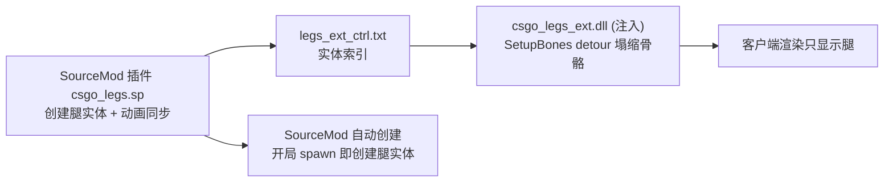

# CS:GO Legacy 看腿（第一人称看自己的腿）— 半成品归档
# CS:GO Legacy "See Your Legs" (First-person legs view) — WIP Archive

> **状态 / Status**: 半成品，留给后人 / Work-in-progress, archived for future maintainers.
> 能跑（能看到腿实体 + 动画同步 + 上半身骨骼隐藏尝试），但存在已知问题（见下）。
> It runs (leg entity + animation sync + upper-body bone collapse attempts), but has known issues (see below).

---

## 目标 / Goal

在 CS:GO Legacy（MIGI 单机精简版，`D:\SteamLibrary\steamapps\common\csgo legacy\`）里实现**第一人称低头看到自己的腿**：
Implement **first-person view of your own legs** in CS:GO Legacy (MIGI standalone, path above):
- SourceMod 插件创建 `monster_generic` 腿实体（自动跟随玩家、同步动画）
  SourceMod plugin creates a `monster_generic` leg entity (auto-follows player, syncs animation)
- **注入 DLL** hook `client.dll` 的 `SetupBones`，把腿实体 hand/arm/head 骨骼矩阵塌缩（隐藏上半身，只留腿）
  **Injected DLL** hooks `SetupBones` in `client.dll` to collapse the leg entity's hand/arm/head bone matrices (hide upper body, keep legs only)

## 架构 / Architecture



## 目录 / Layout

```
legs_project/
├── addons/sourcemod/scripting/csgo_legs.sp        # 插件源码（正式版 63344）Plugin source
├── addons/sourcemod/plugins/csgo_legs.smx         # 插件编译版（24117，正式部署版）Plugin binary
├── addons/sourcemod/gamedata/csgo_legs.games.txt  # SetupBones 签名/偏移 Signature/offset
├── addons/sourcemod/cfg/csgo_legs.cfg             # 调参配置 ConVar snapshot
├── ext/                                           # 注入 DLL + 注入器 Injected DLL + injector
│   ├── csgo_legs_ext.cpp / .dll                   # 核心 hook DLL（143360 正式版）
│   ├── csgo_legs_ext_shadow_backup_v519.cpp       # 更早版本源码备份 Older source backup
│   ├── injector.cpp / .exe                        # 手动注入器 Manual injector
│   ├── auto_injector.cpp / .exe                   # 自动注入守护器 Auto-inject watcher
│   ├── build.bat / build_deploy.bat               # MSVC 32 位编译脚本 Build scripts
│   ├── 注入看腿.bat / 自动注入看腿.bat             # 双击入口 Double-click launchers
│   └── experimental/d3d9_proxy.cpp / .def         # 【实验】d3d9.dll 代理自动加载（已回退）EXPERIMENTAL (reverted)
└── reference/vscript_survivor_legs.nut            # L4D 求生腿参考（父级绑定方案来源）L4D survivor-legs reference
    reference/entlegs_scr.nut
```

## 部署/使用（现状可用）Deployment / Usage

1. 插件：`csgo_legs.smx` → `csgo\addons\sourcemod\plugins\`
   （**注意：SourceMod 会递归加载 plugins 子目录！备份 smx 千万别放 plugins 下，否则双插件冲突**
   ⚠️ SourceMod recursively loads plugins subfolders! NEVER put backup .smx under plugins/ or you get double-plugin conflicts）
2. DLL：`csgo_legs_ext.dll` 放游戏根目录；启动游戏后 `injector.exe csgo_legs_ext.dll`
   Place DLL in game root, then inject after launch (or use `注入看腿.bat`; `自动注入看腿.bat` is the auto-inject watcher)
3. 游戏内 In-game: `sm_legs` on/off; `sm_legs_dbg` status; `sm_legs_off_*` / `sm_legs_rot_*` adjust pose

## ⚠️ 已知问题 / Known Issues（留给后人的重点 / For future maintainers）

### 1. 腿实体"卡位置"（走着卡住，过会又跟上）Leg entity "sticks" (lags then catches up)
- **根因（已确定）Root cause (confirmed)**: 插件 `Hook_PostThinkPost` 每帧 `TeleportEntity` 瞬移，
  服务端每 tick 发网络 origin → 客户端插值断档。与 DLL/探员/插件冲突无关。
  Plugin teleports the leg every frame via `TeleportEntity` → per-tick network origin → client interpolation gaps. Unrelated to DLL/agent/plugin conflicts.
- **官方方案（已验证部分有效）Official fix (partially verified)**: `SetParent` 父级绑定，引擎自动跟随。
  ✅ 跟随 OK、`rot_pitch`（局部角度）有效；❌ **`off_*`（局部 origin）修改无效**——父级绑定后位置由引擎派生。
  ✅ follow works and `rot_pitch` (local angle) works; ❌ **`off_*` (local origin) does NOT take effect** — position is engine-derived after parenting.
- **后续方向 Next steps**: `SetParentAttachmentMaintainOffset` 绑玩家附件（如 `head`）；或参考 `reference/vscript_survivor_legs.nut`（L4D info_target 中间层）。
  Bind to a player attachment (e.g. `head`) via `SetParentAttachmentMaintainOffset`; or use the L4D info_target intermediate layer.
- ⚠️ SourceMod SetParent 正确写法 Required pattern:
  ```pawn
  SetVariantString("!activator");
  AcceptEntityInput(iEntity, "SetParent", client, iEntity);
  ```

### 2. 上半身塌缩（手/头消失）没完全解决 Upper-body collapse not fully solved
- DLL 折叠写 `pBoneToWorldOut`——渲染主路径 `SetupBones(NULL,...)` 不读它（写它永远不生效）。
  The DLL writes to `pBoneToWorldOut`, but the render path calls `SetupBones(NULL,...)` — writes there never take effect.
- **已验证生效路径 Verified working path**: 写 `m_CachedBoneData`（`this+0x2910` 解引用取 `m_pData`，48B/骨骼）——扩展 `csgo_legs.ext`(mcache) 实测**上半身消失成功**。
  Writing `m_CachedBoneData` (`*(float**)(this+0x2910)`, 48B/bone) worked — upper body disappeared (extension mcache build).
- **后续方向 Next steps**: 把 m_CachedBoneData 写入移植回注入 DLL；并确保控制文件链路通（`entities>=1`）。
  Port the m_CachedBoneData write back into the injected DLL; ensure the control-file link is alive (`entities>=1`).

### 3. d3d9.dll 代理（experimental/）D3D9 proxy (experimental, reverted)
- 能让 DLL 自动加载（状态文件证明），但整个方案已回退，仅存档。
  It DID auto-load the DLL (proven by state file), but the whole approach was reverted; kept for reference only.

### 4. 【新增 2026-08-28】第三人称两个模型 / 控制机器人时实体模型与角色不同步
   NEW: Third-person shows TWO models; when controlling a bot, the leg entity does NOT sync with the bot character.
- **现象 Symptoms**:
  - 第三人称视角会看到**两个模型**（玩家角色 + 腿实体重叠/并存）
    In third-person views you see **two models** (player character + leg entity overlapping).
  - **控制机器人（bot）时**，腿实体无法和机器人角色同步：腿实体跟随/动画源仍是"玩家"（client），
    但实际操控的角色是机器人实体 → 位置错位、动画不同步。
    When **controlling a bot**, the leg entity can't sync with the bot: it still follows/animates from the
    `client` player, not the bot entity actually being controlled → mismatched position/animation.
- **可能根因 Likely cause**:
  - 腿实体 `SetTransmit` 只发给 owner（第一人称专用）；第三人称/观战下另一客户端也渲染 → 双模型。
    `SetTransmit` only passes to owner (first-person only); third-person/spectator clients also render it → duplicate model.
  - 动画/跟随源硬编码 `client`（`GetClientAbsOrigin/GetClientEyeAngles/GetEntProp(client,...)`），
    控制机器人时应该读**机器人实体**（bot entity）而不是 client。
    Animation/follow source is hardcoded to `client`; when controlling a bot it must read the bot entity instead.
- **待解决 Not solved** — 记录给后人（方向：以被控制实体为准做跟随/动画源；第三人称对非 owner 隐藏或合并渲染）。
  TODO: use the actually-controlled entity as follow/animation source; hide or merge leg rendering for non-owner clients.

---

## 关键技术点 / Key RE facts

| 项 Item | 值 Value |
|---|---|
| SetupBones RVA（client.dll） | `0x1D3140`（ImageBase `0x10000000` → `0x101D3140`） |
| prologue 特征 magic | `55 8B EC 83...`（`0x83EC8B55`） |
| m_EntIndex | this + `0x60` |
| m_CachedBoneData（CUtlVector） | this + `0x2910`，`*(float**)` 取 m_pData |
| 骨骼矩阵 Bone matrix | 12 float/根（48B），平移在偏移 3/7/11 |
| 塌缩方式 Collapse | 3×3 归零 + 平移至 collapseTarget（spine_0 根=3, target=8） |
| 控制文件 Ctrl file | `legs_ext_ctrl.txt`：第 1 行 enable(0/1)，之后每行一个实体索引 |
| 状态文件 State file | `legs_ext_state.txt`：ready/base/setupbones/writes/enabled/entities/bone_diag |

## 环境/构建 Environment / Build

- SourceMod 1.12.0（spcomp 1.12.7146.11），include 在 `scripting\include`
- MSVC 32 位：`E:\2\VC\Auxiliary\Build\vcvars32.bat` + `cl /O2 /MT /LD`
- 游戏 Game: `D:\SteamLibrary\steamapps\common\csgo legacy\`（MIGI，32 位，listen server）
- 注入 DLL 与游戏必须同为 32 位（Hostx64\x86）

## 版本记录 / Version history

- `v5.20`（正式归档版）：注入 DLL hook pBoneToWorldOut 折叠；插件 TeleportEntity 跟随
- `20260828` 实验：父级绑定（SetParent+info_target）、m_CachedBoneData 写入、d3d9 代理、ConVar 自动重建
  — 完整留档于 `_plugin_backups\parenting_20260828\`（原工作区）

---

## English Summary

**What this is:** A half-finished CS:GO Legacy mod that lets you see your own legs in first person.
Two parts: (1) a SourceMod plugin that creates a `monster_generic` leg entity following the player and
syncing animation from the player model; (2) an injected DLL that hooks `client.dll!SetupBones`
(RVA 0x1D3140) to collapse the entity's upper-body bones (hide hands/head).

**Known issues (archived for the next maintainer):**
1. **Leg sticks in place** — the plugin teleports the entity every frame; the official fix is parent
   binding (`SetParent`, use `SetVariantString("!activator")` first). Follow works; `rot_*` works;
   **`off_*` local origin does NOT** (engine-derived). Next: `SetParentAttachmentMaintainOffset` to a
   player attachment (e.g. `head`), see L4D `reference/`.
2. **Upper-body collapse never worked** because the DLL writes `pBoneToWorldOut` (render path passes NULL).
   Writing `m_CachedBoneData` (`*(float**)(this+0x2910)`) was verified to work in a SourceMod extension —
   port that back into the DLL and keep the control-file link alive (`entities>=1`).
3. **D3D9 proxy experiment** auto-loaded the DLL but was reverted — see `ext/experimental/`.
4. **NEW — third-person shows two models; controlling a bot desyncs the leg entity.** The entity only
   transmits to its owner (first-person only) and its follow/animation source is hardcoded to the `client`
   player — must use the actually-controlled (bot) entity and hide/merge for non-owner clients.

**Environment:** SourceMod 1.12.0 (spcomp 1.12.7146.11), MSVC 32-bit (`vcvars32.bat` + `cl /O2 /MT /LD`),
game `D:\SteamLibrary\steamapps\common\csgo legacy\` (MIGI, 32-bit, listen server).
